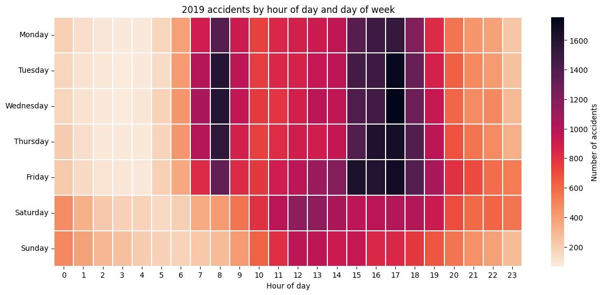
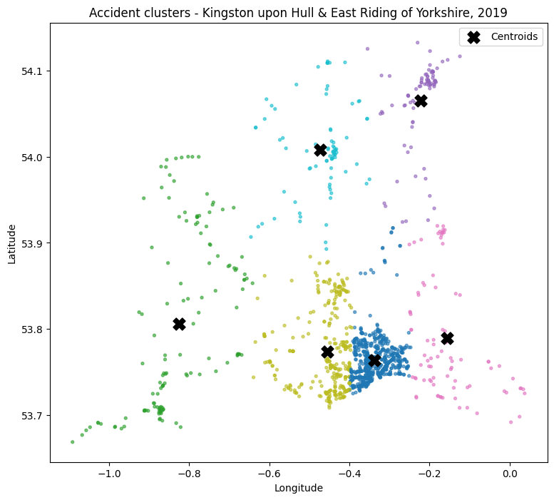
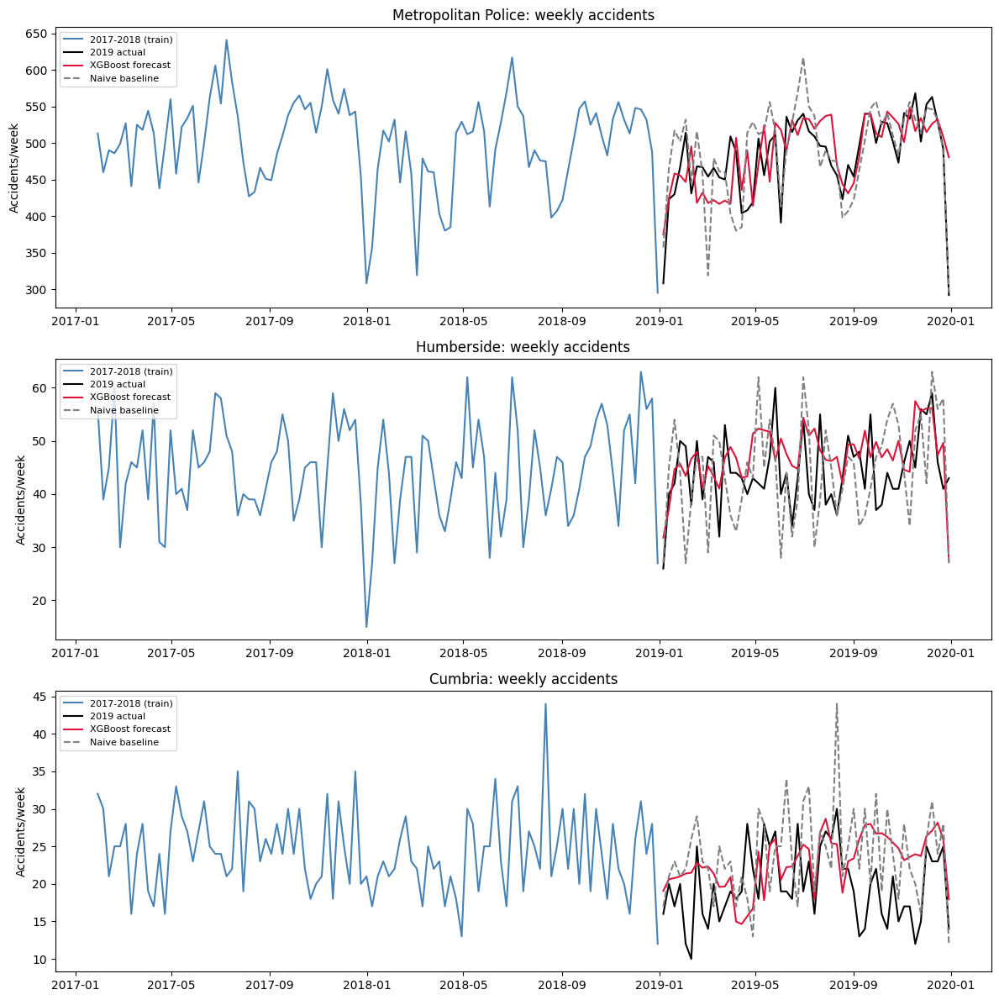

# Road Traffic Accidents in Great Britain (2019): Data Mining, Clustering & Forecasting


An end-to-end analysis of **117,536 road traffic accidents** recorded across Great Britain in 2019, using the Department for Transport's **STATS19** open data. The project answers four practical questions and turns them into recommendations for road-safety decision-makers:

1. **When** do accidents happen, and to whom? *(time patterns: motorcyclists, pedestrians)*
2. **Which conditions** go with serious and fatal outcomes? *(association-rule mining with Apriori)*
3. **Where** do accidents cluster in Kingston upon Hull and East Riding of Yorkshire? *(k-means clustering)*
4. **Can accident volumes be forecast** well enough to plan resources? *(XGBoost with lag features vs a naive baseline)*

> Completed for the Big Data & Data Mining module of the MSc Artificial Intelligence & Data Science at the University of Hull (2026). The report is written as advice to the DfT; it is coursework, not a commissioned study.

---

## Key findings

| | Finding |
|---|---|
| ⏰ | **17:00 is the most dangerous hour** (10,198 accidents in 2019), and **Friday** the busiest day. 75.8% of accidents happen on weekdays, concentrated in the 15:00–18:00 commute. |
| 🚸 | **Pedestrian casualties peak at 15:00** (2,378), matching the school run home, with a second peak at 08:00 (1,779). |
| 🏍️ | **Large motorcycles are a weekend risk:** 31.3% of accidents on bikes over 500cc happen at weekends, vs 23.2% for 125cc and below. |
| 🛣️ | **Speed and rural roads drive severity, not bad weather.** 60mph + rural + dry + away from a junction makes a *serious* outcome 1.6× more likely than average. Add unlit darkness and a *fatal* outcome becomes about 3.6× more likely. |
| 📍 | **In Hull and East Riding, rural high-speed clusters are the most severe.** Urban Hull has over half the local accidents but a killed-or-seriously-injured (KSI) rate of 18.4%. The two most rural clusters reach 25.6% and 25.3%. |
| 📈 | **Forecasting helps where data supports it.** XGBoost beat the naive baseline for Humberside and Cumbria, but not for the Metropolitan Police. |

<p align="center">
  
</p>

---

## Analysis

### 1. Data preparation
- **Source:** the 2019 accident table (117,536 records, no duplicate keys), plus a separately queried 2017–2020 dataset for forecasting. Both come from a SQLite copy of STATS19.
- **Missing coordinates:** 28 records had none. They were **filled with the median latitude/longitude of their local authority district**, chosen after comparing how spread out coordinates were at district and highway-authority level. Median and mean were checked first to rule out distortion from outliers.
- **Missing codes:** STATS19's `-1` "missing / not applicable" code was **kept rather than guessed**, and excluded row by row from any calculation it would distort.
- **Consistency:** the same lookup filled both datasets. Six 2020 records with no district fall outside every analysis window, so they were left and documented.

### 2. When do accidents happen?
- Accidents concentrate in the **weekday 15:00–18:00** window: school run, shift changes and the evening commute, often in fading light.
- **Motorcycles**, grouped by engine size (≤125cc: 8,053 · 125–500cc: 2,119 · >500cc: 5,228):
  - Each group was normalised against its own total so group size doesn't skew the comparison.
  - All groups peak at rush hour, but larger bikes are ridden far more at weekends, consistent with leisure riding.
- **Pedestrian casualties** (n = 21,770) track the school day and fall sharply at weekends.

### 3. Which conditions go with severe outcomes? (Apriori)
- **Inputs:** speed limit, lighting, weather, road surface, urban/rural and junction type, one-hot encoded and mined with the **Apriori** algorithm (`mlxtend`).
- **Rule format:** each rule's outcome was restricted to one severity level, so rules read as *conditions → severity*.
- **Rare fatal outcomes:** fatal accidents are only **1.4%** of the data, so a second pass used a lower minimum support (0.002 vs 0.01) to surface them.

| Conditions | Outcome | Confidence | Lift |
|---|---|---|---|
| 60mph, Rural, Dry, Not at junction | Serious | 32.0% | 1.64 |
| 60mph, Rural, Dry, Not at junction, Daylight | Serious | 31.7% | 1.62 |
| 60mph, Rural, Not at junction, Dry | Fatal | 5.2% | 3.66 |
| 60mph, Rural, Not at junction, Darkness (no lighting) | Fatal | 5.1% | 3.62 |

*Baseline rates: Serious 19.6%, Fatal 1.4%.*

**The counter-intuitive result:** most driving happens in fine, dry conditions whatever the outcome. What stands out is **speed, and missing junctions, lighting and urban infrastructure** that would otherwise absorb a driver's mistake.

### 4. Where do accidents cluster? Hull and East Riding (k-means)
- **Area filter:** accidents were limited to Kingston upon Hull and East Riding using Lower Super Output Area (LSOA) names; 90.0% matched the lookup. The police-force area wasn't used because Humberside Police also covers North and North East Lincolnshire.
- **Clustering:** 1,420 accidents (739 Hull, 681 East Riding) were clustered on latitude and longitude for k = 2–14. The **elbow method** pointed to **k = 6**.
- **Why k-means:** it assigns every accident to a region, which suits describing the whole area better than density-based hotspot methods.

| Cluster profile | Urban/rural mix | Avg speed limit | KSI rate |
|---|---|---|---|
| Urban Hull (724 accidents, over half the region) | 94.5% urban | 30.9 mph | 18.4% |
| Most rural East Riding cluster | 83.7% rural | ≈49 mph | 25.6% |
| Second most rural East Riding cluster | 77.2% rural | ≈49 mph | 25.3% |

*The two rural clusters have fewer than 200 accidents combined, yet the highest severity in the region.*

<p align="center">
  
</p>

### 5. Forecasting accident volumes
- **Approach:** each forecast was set up as a **supervised regression**. Each time period is one row, with lagged counts, a calendar feature and a trend index as inputs.
- **Model:** a **gradient-boosted regressor (XGBoost: 100 trees, depth 5, learning rate 0.1)**, always compared against a **naive lag baseline**.
- **Seasonal lags** (52-week and 7-day) were tried and dropped: they used up too much of an already short training window.

**Weekly accidents by police force, 2019** (trained on 2017–2018):

| Police force | XGBoost RMSE | Baseline RMSE | XGBoost MAPE | Baseline MAPE | Verdict |
|---|---|---|---|---|---|
| Metropolitan Police | 49.5 | **47.0** | 8.4% | **7.3%** | Baseline wins (only ~101 usable training rows) |
| Humberside | **7.4** | 10.4 | **14.6%** | 19.6% | XGBoost wins |
| Cumbria | **6.3** | 7.7 | **30.7%** | 35.1% | XGBoost wins |

<p align="center">
  
</p>

**Daily accidents in Hull's 30 highest-accident LSOAs**, forecasting July 2019 from January–June:
- **Monthly total:** the model predicted 30.2 accidents against **25 actual**, closer than the baseline's 32.2.
- **Day by day:** the baseline had slightly lower error (MAE 0.736 vs 0.795). With about one accident a day across 30 areas, daily counts are very noisy.
- **Takeaway:** use the model for **monthly resource planning**, not for predicting specific days.

**Overall lesson:** how reliable a forecast is depends on **how much data is available relative to model complexity**, not on the size of the area. Rare outcomes and sparse series need lower thresholds or coarser time periods.

---

## Recommendations

1. **Target enforcement and school-safety measures at peak times:** crossing patrols, 20mph zones and school streets during weekday 08:00 and 15:00–17:00.
2. **Tailor motorcycle safety campaigns by engine size:** weekday commuter and training campaigns for riders of 125cc and below; weekend and rural "biker route" enforcement for 500cc+.
3. **Prioritise rural, high-speed road infrastructure:** average-speed cameras and better lighting on unlit 60mph rural roads away from junctions, where severity is highest.
4. **Use predictive models for aggregated planning:** apply lag-feature models to medium and small forces and to pooled hotspot areas, not to day-level planning.
5. **Review LSOA hotspot lists quarterly** so resources follow where accidents are concentrating.

---

## Limitations
- The main analysis covers 2019 only; patterns may have shifted since, for example after COVID-19.
- Association rules show **co-occurrence, not causation**.
- Forecasts use short histories (two years for weekly models, six months for daily models). Longer histories and extra variables such as weather and public holidays could improve them.
- 10% of Hull and East Riding accidents couldn't be matched to an LSOA, so they aren't in the clustering.

---

## Repository structure

```
├── uk_road_accident_analysis_2019.ipynb   # Full analysis: cleaning → EDA → Apriori → clustering → forecasting
├── images/                                # Figures used in this README
├── requirements.txt
└── README.md
```

## How to run

```bash
git clone https://github.com/Emily-Ngahu/UK-Road-Accident-Analysis.git
cd UK-Road-Accident-Analysis
pip install -r requirements.txt
```

1. The notebook reads a local SQLite database named **`accident_data_v1.0.0_2023.db`** (≈200 MB), containing the STATS19 `accident`, `vehicle` and `casualty` tables plus an `lsoa` lookup table, provided as part of the module. It's too large for GitHub, so it isn't included.
2. The underlying data is published by the Department for Transport under the **Open Government Licence v3.0**: [Road Safety Data](https://www.data.gov.uk/dataset/cb7ae6f0-4be6-4935-9277-47e5ce24a11f/road-safety-data).
3. Place the database next to the notebook, open `uk_road_accident_analysis_2019.ipynb` in Jupyter, and run all cells.

## Tech stack

Python · SQL (SQLite) · pandas · NumPy · mlxtend (Apriori) · scikit-learn (k-means, metrics) · XGBoost · Matplotlib · Seaborn · Jupyter

## Data licence

Contains public sector information licensed under the Open Government Licence v3.0. Source: Department for Transport, STATS19 road safety data.

---

## Author

**Emily Ngahu**, Data Scientist · MSc Artificial Intelligence & Data Science, University of Hull

[LinkedIn](https://www.linkedin.com/in/emily-ngahu/) · [GitHub](https://github.com/Emily-Ngahu) · emilyngahu9@gmail.com
